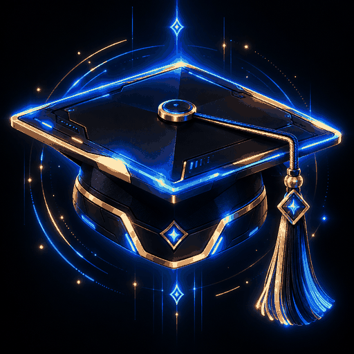

<p align="center"></p>

# ✦ NovaStudy — Student Routine OS

**A futuristic, responsive, offline-first student planner with installable PWA support.**

A free, no-login routine app for learners from early childhood to university / postgraduate studies. Supports Bengali education categories and a customizable international option.

## Features

**Source update:** Browser code is split into core state, view renderers, modal editors, and event/controller modules for maintainability.

- **Education setup:** Primary School; Secondary School; Higher Secondary / College; Madrasah; Diploma / Technical / Vocational; University / Higher Education; Other / International / Custom.
- **Class / academic year, group / major:** Preset choices for school groups, college streams, technical departments, university majors (CSE, EEE, BBA, law, medicine, architecture, etc.) with editable subject suggestions.
- **Auto study planner:** Generate balanced study blocks for 1–7 days with adjustable start time, length, breaks and sessions/day; preserves existing entries and avoids clashes.
- **Timetable:** Add/edit/delete weekly sessions; day, start/end, course, location, session type. Detects overlap without blocking intentional overlaps.
- **Dashboard:** Today's timeline, total planned hours, pending missions, task completion.
- **Themes (v1.2):** Visual Cyber / Black & Gold theme selector in Settings, header toggle, mobile adjustments, and saved theme preference across refresh and same-origin tabs. Saved routines, subjects and tasks remain unchanged.
- **Missions:** To-dos with due dates, subject associations, priorities, completion, filtering and search.
- **Privacy:** Data is stored locally in your browser. No accounts, analytics, server databases, or external runtime dependencies.
- **Backup:** Export/import JSON; import asks for confirmation, checks basic backup format and limits file size.
- **PWA:** Add to Home Screen / installable on supported Android, iOS and desktop browsers. Service worker caches the app shell for offline use after a successful HTTPS visit.
- **Optional browser notifications:** Reminders work only while the app is open/active and browser APIs allow it. Background push notifications are not implemented.

> Subject lists are **starter suggestions, not claims of exact or official curricula**. Actual subjects vary by board, country, institution and semester; add, delete or rename any subject. The starter demo schedule is fictional.

## Quick start (VS Code)

No npm, database or paid hosting is required.

1. Download or clone the project and open the `NovaStudy-Routine` folder in VS Code.
2. Serve it from a local web server (opening `index.html` directly disables PWA/service worker features).
3. In the terminal, run either:

```powershell
npx serve . -l 5173
```

or, if you have Python installed:

```powershell
python -m http.server 5173
```

4. Open `http://localhost:5173`.

## GitHub repository and VS Code sync

Repository: https://github.com/gitwithmasum/NovaStudy-Routine

First-time clone:

```powershell
git clone https://github.com/gitwithmasum/NovaStudy-Routine.git
cd NovaStudy-Routine
```

To sync an already cloned folder:

```powershell
git pull --ff-only origin main
```

For future updates:

```powershell
git add .
git commit -m "chore: improve routine planner"
git push
```

GitHub repository URL: `https://github.com/gitwithmasum/NovaStudy-Routine`.

## Deploy to **Vercel** (recommended)

1. Open https://vercel.com/new and sign in with GitHub.
2. Select **Import Git Repository** → `NovaStudy-Routine`.
3. Framework Preset **Other** (it's native HTML/CSS/JS; **no build command**); Root Directory `./`; output uses project root.
4. Click **Deploy**.
5. Verify HTTPS URL, Add Session, Profile category, editing subjects, and PWA install prompt.
6. When Git integration is connected, pushes to `main` automatically redeploy.

Alternate CLI from the project folder:

```powershell
npm i -g vercel
vercel login
vercel --prod
```

The project includes `vercel.json`.

## Deploy to **Netlify** (third hosting option)

1. Open https://app.netlify.com/start and log in.
2. Add new project → Import an existing project → GitHub → `NovaStudy-Routine`.
3. Branch `main`; Build Command **leave empty**; Publish directory `.`.
4. Deploy. The `netlify.toml` file already sets `publish = "."`.
5. Ensure PWA works over Netlify's generated HTTPS site.

GitHub Pages is a **fourth** optional static host: GitHub repo → Settings → Pages → Deploy from branch → `main` / `(root)` → Save. Site is typically `https://gitwithmasum.github.io/NovaStudy-Routine/` when published. Relative asset paths and PWA scope are designed to support subfolder hosting.

## Install on a phone

- **Android Chrome:** Open the deployed HTTPS URL → tap the app's **Install app** button if an installation prompt is offered, or ⋮ menu → Install app / Add to Home screen.
- **iOS Safari:** Open HTTPS URL → Share → Add to Home Screen → Add. On iOS, browser notifications have platform restrictions; foreground reminders should not be relied upon for alarms.
- **Desktop Chrome / Edge:** Browser install icon in address bar or browser menu.

A PWA is installed from the browser. This project **does not** produce an Android APK or iOS IPA. Those require a separate packaging / native mobile release workflow (e.g., Capacitor, TWA or app store submission).

## Project files

```
NovaStudy-Routine/
├── index.html
├── styles.css
├── presets.js
├── core.js
├── views.js
├── editors.js
├── app.js
├── manifest.webmanifest
├── sw.js
├── assets/
│   ├── icon-192.png
│   └── icon-512.png
├── vercel.json
├── netlify.toml
├── QUICK_START_BN.md
├── .gitignore
├── LICENSE
└── README.md
```

## Roadmap ideas for v2

- Supabase / Firebase Auth and encrypted cloud sync for cross-device routines (do not enable without migration/backups)
- Server push notification scheduling, calendars, exam planner, routine templates, pomodoro
- Multi-language UI (Bangla + English), syllabus packs for specific boards, and smart clash resolver
- Accessible drag & drop and export to printable PDF / calendar ICS

## Data handling

- State is stored in `localStorage` under `novastudy_state_v1`. It can be lost when browser storage is cleared, incognito closes, or the browser profile changes.
- Backups are local JSON files. Use export regularly.
- Do not import JSON backups from untrusted people.
- A service worker caches public app files, **not** private data. No backend is required for v1.

## License

MIT — © 2026 Masum Billah.
## v1.3 — Smart Timetable & Exam Planner

- **Exams & revision** (desktop and mobile): add, edit, complete/reopen, or delete an exam with subject, date, start/end, location, and notes.
- **Countdown:** next upcoming exam appears on the dashboard, with dynamic device-local countdowns on the Exam page.
- **Repeat controls:** sessions can repeat weekly (optional end date), or occur once on a specific date. Existing saved timetable entries remain weekly by default.
- **Revision plan:** select an exam, session count, duration, and start time. NovaStudy adds dated **one-time revision sessions plus linked tasks**, shifting forward in 15-minute steps where needed to avoid clashes. Running again avoids duplicate dates; tightly spaced exams may result in fewer sessions.
- **Backward-compatible data:** existing `novastudy_state_v1` records and v1 JSON backup files remain valid; `exams: []` is initialized if missing. No need to reset local storage.
- **Privacy:** all data remains on the device. No cross-device sync or guaranteed background alarms.
- **Deleting an exam** does not delete existing revision sessions/tasks, preventing accidental loss of your study history.

### Try it
Select **Exams & revision → Add exam → Plan revision**. Check your **Weekly routine** for one-time blocks and **Tasks & goals** for linked revision to-dos.

### Graduation-cap app branding (v1.3.1)
The selected futuristic graduation-cap artwork is now the app icon for installable PWA (192px and 512px), browser favicon, Apple touch icon and sidebar/mobile navigation logo. Updated files preserve all previous routine and exam-planner features. If the old icon persists after updating, refresh/reinstall the installed app to clear old cached icons.
